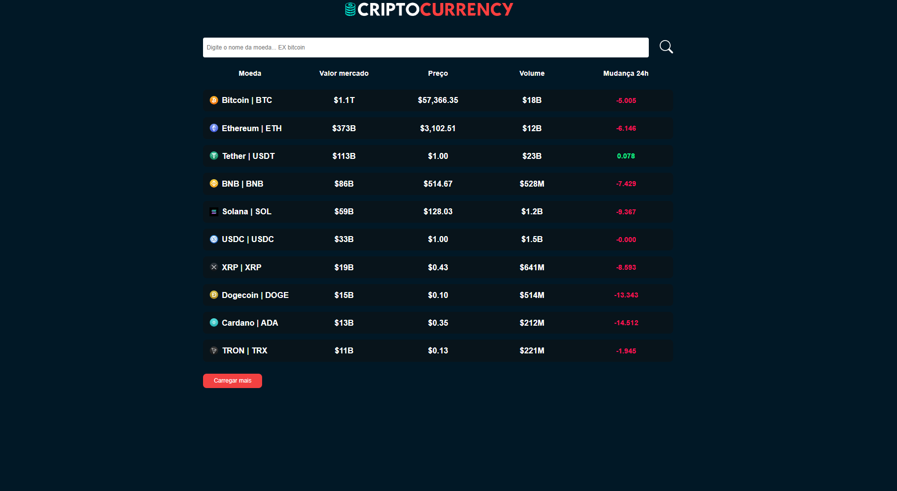
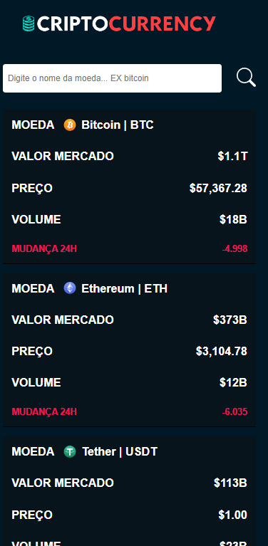

# Projeto Criptocurrency
Utilizando React, TypeScript e CSS, desenvolvi um projeto de estudo chamado Criptomoeda. Este projeto se integra a uma API externa para fornecer valores de mercado em tempo real para diversas criptomoedas. Ele oferece uma visão geral abrangente de dados importantes, como nome da moeda, valor de mercado, preço atual, volume e variação de 24 horas. Além disso, o projeto inclui um recurso de pesquisa personalizado, facilitando aos usuários a localização de informações sobre suas criptomoedas preferidas. Através deste projeto, tive a oportunidade de aplicar meus conhecimentos de React.js e TypeScript enquanto explorava o mundo das criptomoedas e a integração de APIs externas no desenvolvimento web. Ganhei essa valiosa experiência através de um curso ministrado por Matheus Fraga, professor do Sujeito Programador

 ## 👨‍💻 O que eu aprendi
* Utilizar `react-router-dom` para definir os caminhos e lidar com rotas não encontradas (erro 404).
* Utilização de gerenciamento de estado com React Hooks, como `useState` e `useEffect`, para manter a consistência dos dados em toda a aplicação.
* Tipagem forte com TypeScript, aproveitando interfaces para definir estruturas de dados.
* Requisições à API externa para obter os dados das criptomoedas, utilizando o método JavaScript Fetch.
* Renderizações condicionais para exibir informações específicas com base nas interações do usuário.
* Aplicar a responsabilidade do @media screen, podendo ser utilizado em dispositivos desktops ou mobile.

### Screenshot

#### Version Desktop

#### Version Mobile

### 📦 Tecnologias usadas

## 👷 Autores

* **Guilherme Alves Silva** - *Desenvolvedor do Projeto* - [GuilhermeAlves](https://github.com/bitsbygui)

  
## 📄 Licença

Esse projeto está sob a licença (MIT) - acesse os detalhes [LICENSE.md](https://github.com/git/git-scm.com/blob/main/MIT-LICENSE.txt).

## 💡 Expressões de gratidão

* Um agradecimento publicamente.
* Para suporte, mande um email para guilhermealvesskr@gmail.com.
* Link para o seu linkedin [Meu linkedin]([https://url_do_link](https://www.linkedin.com/in/guilhermealvessilva/)https://www.linkedin.com/in/guilhermealvessilva/)
